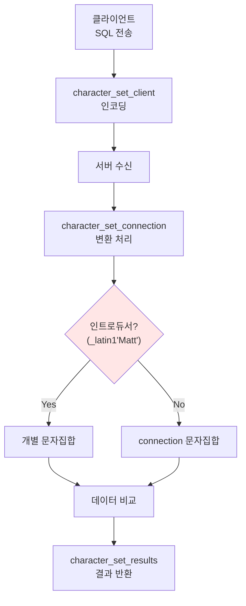

# 15.1 
## 15.1.3 문자 집합
- 최종적으로는 컬럼별로 문자 집합을 관리한다.
- 테이블 단위로 기본 문자 집합을 사용할 수 있는 기능을 제공한다.
	- 각 칼럼에 대해 문자 집합을 별도로 지정할 수 있다.

- 한글 기반 서비스에서는 `euckr`, `utf8mb4` 를 적용하는 것이 일반적이다.
- utf8mb4가 기본적

- latin 계열은 간단하게 사용할 때, 공간절약을 위해
- euckr은 한국어 전용
- utf8mb4는 다국어 문자를 포함
	- 1~4바이트 까지 사용하지만, 문자당 4바이트로 고정되는 경우도 있다.
- utf8은 utf8mb4의 하위 집합이다.
	- 1~3 바이트 사용
### 문자 집합 관련 변수
**`character_set_system` : 시스템 식별자 문자 집합**
- **역할**: MySQL 서버가 식별자(identifier), 데이터베이스 명이나 칼럼 명 등을 저장할 때 사용하는 문자 집합
- **특징**: 기본적으로 utf8로 설정되며, 사용자가 설정하거나 변경할 필요가 없음

**`character_set_server` : 서버 기본 문자 집합**
- **역할**: MySQL 서버의 기본 문자 집합
- **특징**:
    - DB나 테이블 또는 칼럼에 아무런 문자 집합이 설정되지 않을 때 이 시스템 변수에 명시된 문자 집합이 기본으로 사용됨
    - 기본값은 utf8mb4

**`character_set_database` : 데이터베이스 기본 문자 집합**
- **역할**: MySQL DB의 기본 문자 집합
- **특징**:
    - DB를 생성할 때 아무런 문자 집합이 명시되지 않았다면 이 시스템 변수에 명시된 문자 집합이 기본값으로 사용됨
    - 이 변수가 정의되지 않으면 character_set_server 시스템 변수에 명시된 문자 집합이 기본으로 사용됨
    - 기본값은 utf8mb4

**`character_set_filesystem` : 파일시스템 문자 집합**
- **역할**: `LOAD DATA INFILE ...` 또는 `SELECT ... INTO OUTFILE` 문장을 실행할 때 인자로 지정되는 파일의 이름을 해석할 때 사용되는 문자 집합
- **특징**:
    - 여기서 주의해야 할 것은 데이터 파일의 내용을 읽을 때 사용하는 문자 집합이 아니라 파일의 이름을 찾을 때 사용하는 문자 집합
    - 각 커넥션에서 임의의 문자 집합으로 변경해서 사용할 수 있음
    - 기본값은 binary
    - `LOAD DATA INFILE` 명령이나 `SELECT INTO OUTFILE` 명령에서 파일명을 제대로 인식하지 못한다면 character_set_filesystem 시스템 변수를 utf8mb4로 변경하는 것이 좋음

**`character_set_client` : 클라이언트 전송 문자 집합**
- **역할**: MySQL 클라이언트가 보낸 SQL 문장은 character_set_client에 설정된 문자 집합으로 인코딩해서 MySQL 서버로 전송됨
- **특징**:
    - 각 커넥션에서 임의의 문자 집합으로 변경해서 사용할 수 있음
    - 기본값은 utf8mb4
    - SQL 문장에서 문자열 리터럴에 대해 인트로듀서(`_utf8mb4 'string_value'` 형태로 문자열 리터럴에 문자 셋을 설정하는 방법)가 사용된 경우에는 character_set_client 시스템 변수와 무관하게 개별적으로 설정된 문자 셋이 적용됨

**`character_set_connection` : 커넥션 처리 문자 집합**
- **역할**: MySQL 서버가 클라이언트로부터 전달받은 SQL 문장을 처리하기 위해 character_set_connection의 문자 집합으로 변환함
- **특징**:
    - 클라이언트로부터 전달받은 숫자 값은 문자열로 변환할 때도 character_set_connection에 설정된 문자 집합이 사용됨
    - 각 커넥션에서 임의의 문자 집합으로 변경해서 사용할 수 있음
    - 기본값은 utf8mb4

**`character_set_results` : 쿼리 결과 반환 문자 집합**
- **역할**: MySQL 서버가 쿼리의 처리 결과를 클라이언트로 보낼 때 사용하는 문자 집합을 설정하는 시스템 변수
- **특징**:
    - 각 커넥션에서 임의의 문자 집합으로 변경해서 사용할 수 있음
    - 기본값은 utf8mb4

![[Pasted image 20250629165803.png]]

### 클라이언트 쿼리 변환

- `_latin` 같은 인트로듀서를 이용해서 문자열을 지정해서 변환할 수 있다.
- 각 단계에서 문자 집합이 같다면, 따로 변환 작업은 이루어지지 않는다.
	- 문자 집합은 물론이고, 콜레이션까지 포함해서 같은지 다른지 비교한다.

### 한번에 문자 집합 바꾸는 변경 명령어
```mysql
mysql> SET NAMES utf8mb4; -- 
mysql> CHARSET utf8mb4; -- 클라이언트 프로그램 설정 (재접속해도 유효)
```

| 구분        | SET NAMES            | CHARSET            |
| --------- | -------------------- | ------------------ |
| **문법**    | SQL 표준 문법            | MySQL 클라이언트 전용 명령어 |
| **사용 위치** | 어디서나 사용 가능           | MySQL 클라이언트에서만     |
| **효과**    | 3개 문자집합 변수 변경        | 3개 문자집합 변수 변경 (동일) |
| **지속성**   | 커넥션 종료시 초기화          | 재접속해도 유효           |
| **예시**    | `SET NAMES utf8mb4;` | `CHARSET utf8mb4;` |

---
## 15.1.4 콜레이션
- 콜레이션은 문자열 칼럼의 값에 대한 **비교나 정렬 순서**를 위한 규칙
	- 영문 대소문자를 같은 것으로 처리할지, 아니면 더 크거나, 더 작은것으로 판단할지에 대한 규칙

####  MySQL의 콜레이션 특징
- MySQL의 모든 문자열 타입의 칼럼은 **독립적인 문자 집합과 콜레이션**을 가집니다
- 각 칼럼에 대해 독립적으로 문자 집합이나 콜레이션을 지정하는 것도 가능하지만, **독립적인 문자 집합과 콜레이션을 가지는 것**이 일반적입니다
- 각 칼럼에 대해 독립적으로 지정하지 않으면 **MySQL 서버나 DB의 기본 문자 집합과 콜레이션이 자동으로 설정**됩니다

### 15.1.4.1 콜레이션 이해
#### 콜레이션의 역할
각 문자열 칼럼의 값을 비교하거나 정렬할 때는 
- 항상 문자 집합뿐만 아니라 콜레이션의 일치 여부에 따라 결과가 달라진다, 
- 쿼리의 성능 또한 상당한 영향을 받습니다.

#### 콜레이션에 대한 이해
- 문자 집합은 두개 이상의 콜레이션을 가짐
- 하나의 문자 집합에 속한 콜레이션은 다른 집합과 공유해서 사용할 수 없음.
- 칼럼에 콜레이션만 지정하면, 콜레이션이 소속된 문자 집합이 그 칼럼의 문자 집합으로 사용된다.
- `SHOW COLLATION` 으로 확인할 수 있다.

| Collation           | Charset | Id  | Default | Compiled | Sortlen | Pad_attribute |
| ------------------- | ------- | --- | ------- | -------- | ------- | ------------- |
| ascii_bin           | ascii   | 65  |         | Yes      | 1       | PAD SPACE     |
| ascii_general_ci    | ascii   | 11  | Yes     | Yes      | 1       | PAD SPACE     |
| euckr_bin           | euckr   | 85  |         | Yes      | 1       | PAD SPACE     |
| euckr_korean_ci     | euckr   | 19  | Yes     | Yes      | 1       | PAD SPACE     |
| latin1_bin          | latin1  | 47  |         | Yes      | 1       | PAD SPACE     |
| latin1_general_ci   | latin1  | 48  |         | Yes      | 1       | PAD SPACE     |
| latin1_general_cs   | latin1  | 49  |         | Yes      | 1       | PAD SPACE     |
| utf8mb4_0900_ai_ci  | utf8mb4 | 255 | Yes     | Yes      | 0       | NO PAD        |
| utf8mb4_0900_as_ci  | utf8mb4 | 305 |         | Yes      | 0       | NO PAD        |
| utf8mb4_0900_as_cs  | utf8mb4 | 278 |         | Yes      | 0       | NO PAD        |
| utf8mb4_0900_bin    | utf8mb4 | 309 |         | Yes      | 1       | NO PAD        |
| utf8mb4_bin         | utf8mb4 | 46  |         | Yes      | 1       | PAD SPACE     |
| utf8mb4_general_ci  | utf8mb4 | 45  |         | Yes      | 1       | PAD SPACE     |
| utf8mb4_unicode_ci  | utf8mb4 | 224 |         | Yes      | 8       | PAD SPACE     |
| utf8_bin            | utf8    | 83  |         | Yes      | 1       | PAD SPACE     |
| utf8_general_ci     | utf8    | 33  | Yes     | Yes      | 1       | PAD SPACE     |
| utf8_unicode_520_ci | utf8    | 214 |         | Yes      | 8       | PAD SPACE     |
| utf8_unicode_ci     | utf8    | 192 |         | Yes      | 8       | PAD SPACE     |

#### 콜레이션 이름 규칙
##### 3개의 파트로 구성된 콜레이션 이름
1. **첫 번째 파트**: 문자 집합의 이름
2. **두 번째 파트**: 해당 문자 집합의 하위 분류를 나타냄
3. **세 번째 파트**: 대문자나 소문자의 구분 여부를 나타냄
    - **"ci"**: 대소문자를 구분하지 않는 콜레이션(Case Insensitive)
    - **"cs"**: 대소문자를 별도의 문자로 구분하는 콜레이션(Case Sensitive)
##### 2개의 파트로 구성된 콜레이션 이름
1. **첫 번째 파트**: 마찬가지로 문자 집합의 이름
2. **두 번째 파트**: 항상 **"bin"**이라는 키워드가 사용됨
    - **"bin"**: 이진 데이터(binary)를 의미
    - 이진 데이터로 관리되는 문자열 칼럼은 **별도의 콜레이션을 가지지 않음**
    - 콜레이션이 **"xxx_bin"**이라면 비교 및 정렬은 **실제 문자 데이터의 바이트 값을 기준으로 수행됨**
> [!info] 예시
> - `utf8mb4_general_ci`: utf8mb4 + general + case insensitive
> - `utf8mb4_bin`: utf8mb4 + binary (바이트 값 기준 정렬)
> - `latin1_general_cs`: latin1 + general + case sensitive

#### utf8mb4 콜레이션의 이름
많이 복잡해졌음;;;

##### UCA(Unicode Collation Algorithm) 버전 표시
- "utf8mb4_0900"으로 시작하는 콜레이션에서 "0900"은 UCA(Unicode Collation Algorithm)의 버전을 의미
	- UCA는 **문자 비교 규칙 정도로 이해**하면 됨
	- 예시: `utf8mb4_unicode_520_ci` 콜레이션에서 **"520"** 은 **UCA 5.2.0**을 의미
	- *확인결과 2024-08-22 로 발표된 16.0.0 이 최신 사양*
- UCA의 버전이 올라갈수록 문자 간의 정렬 순서와 비교 규칙은 더 정교해지고 언어별 특성이 더 잘 반영된 버전이라고 볼 수 있음

##### 액센트 처리 방식
utf8mb4 문자 집합에서는 **액센트 문자의 구분 여부가 콜레이션의 이름에 포함**되었습니다.
- **"utf8mb4_0900_ai_ci"** 와 같이 "ai"  또는 "as"를 포함하는 경우가 있음
- 이는 **액센트를 가진 문자(Accent Sensitive)와 그렇지 않은 문자(Accent Insensitive)들을 정렬 순서상 동일 문자로 판단할지 여부**를 나타냄

##### 액센트 처리 방식별 설명
- **"ai"**: 다음의 5개 문자는 **정렬 순서상 동일하게 취급됨** (여기서 한 가지 주의할 것은 콜레이션이 정렬 순서에만 영향을 미치는 것이 아니라 **동일 문자인지 아닌지의 검색 결과에도 영향을 미친다는 점**임)
- **정렬의 크다 작다는 개념 자체가 비교의 결과**이기 때문

**예시**: `e, è, é, ê, ë` - 이 5개 문자가 ai 설정에서는 동일하게 처리됨

기본적으로 문자 집합의 기본 콜레이션들은 다 case insensetive이다.
그러니 대소문자 구분이 필요하다면 `cs`를 사용하던가, `bin`을 사용하자.
- 보통 `bin`도 대소문자 순으로 코드 값이 부여되므로 특별히 문제는 없을 것

#### 콜레이션 설정하기
문자 집합과 콜레이션까지 일치해야 똑같은 타입이라고 할 수 있다.
- 똑같은 타입이어야 조인이나, WHERE 조건이 인덱스를 효율적으로 사용할 수 있다.

##### 데이터베이스 수준 설정
```mysql
CREATE DATABASE db_test CHARACTER SET=utf8mb4;
```
- **CREATE DATABASE 명령**으로 기본 문자 집합이 utf8mb4인 DB를 생성한다. 
	- 콜레이션은 명시적으로 정의하지 않았지만 
	  **utf8mb4의 기본 콜레이션인 utf8mb4_0900_ai_ci가 기본 콜레이션이 된다.**
- db_test DB 내에서 생성되는 테이블이나 칼럼 중에서 **별도로 문자 집합과 콜레이션을 정의하지 않으면 
  모두 utf8mb4 문자 집합과 utf8mb4_0900_ai_ci 콜레이션을 사용하도록 자동 설정된다.**

##### 테이블 수준 설정
```mysql
CREATE TABLE tb_member (
    member_id VARCHAR(20) NOT NULL COLLATE latin1_general_cs,
    member_name VARCHAR(20) NOT NULL COLLATE utf8_bin,
    member_email VARCHAR(100) NOT NULL,
    ...
);
```
- **CREATE TABLE 명령**에서는 각 칼럼이 서로 다른 문자 집합이나 콜레이션을 사용하게 정의했다.
- **tb_member 테이블을 생성하면서 member_id 칼럼의 콜레이션을 latin1_general_cs로 설정**
    - member_id 칼럼은 **숫자나 영문 알파벳, 키보드의 특수 문자 위주로만 저장할 수 있고, 
      "cs" 계열의 콜레이션이므로 대소문자 구분을 하는 정렬과 비교를 수행**
- **member_name 칼럼은 콜레이션이 utf8_bin으로 설정**
	- 한글이나 다른 나라의 언어를 사용할 수 있지만 "\_bin" 계열의 콜레이션이 사용되었으므로 대소문자를 구분하는 정렬과 비교를 수행
- **member_email 칼럼은 아무런 문자 집합이나 콜레이션을 정의하지 않았으므로 DB의 기본 문자 집합과 콜레이션을 그대로 사용**
    - 그래서 member_email 칼럼은 **utf8mb4_0900_ai_ci 콜레이션을 사용하고, 
      비교나 정렬 시 대소문자를 구분하지 않는다**

##### 검색과 정렬
WHERE를 이용한 검색은 대소문자를 구분하지 않고 실행하고, 정렬은 대소문자를 구분해서 해야할 때,
둘 중 하나는 인덱스 이용을 포기할 수 밖에 없다.
- 검색은 "\_ci"로 만들어서 인덱스를 이용할 수 있게 하고,
- 정렬은 인덱스를 사용하지 않는 명시적인 정렬 (Using Filesort)로 처리하는 것이 일반적이다.
- 모두 인덱스를 이용하려면, 정렬을 위한 컬럼을 추가하고, 
  검색은 원본칼럼을, 정렬은 추가된 칼럼을 이용하는 방법도 있다.


### 15.1.4.2 utf8mb4 문자 집합의 콜레이션
대부분 다국어 지원이 가능한 utf8mb4를 사용한다.

#### 언어 종속적인 콜레이션 / 언어 비종속적인 콜레이션
Locale이 포함되어 있는지 여부로 구분할 수 있다.

| 콜레이션                     | 언어               | 표기               |
| ------------------------ | ---------------- | ---------------- |
| utf8mb4_0900_ai_ci       | N/A              | 없음               |
| utf8mb4_zh_0900_as_cs    | 중국어              | zh               |
| utf8mb4_la_0900_ai_ci    | 클래식 라틴           | la 또는 roman      |
| utf8mb4_de_pb_0900_ai_ci | 독일 전화번호 안내 책자 순서 | de_pb 또는 german2 |
| utf8mb4_ja_0900_as_cs    | 일본어              | ja               |
| utf8mb4_ro_0900_ai_ci    | 로마어              | ro 또는 romanian   |
| utf8mb4_ru_0900_ai_ci    | 러시아어             | ru               |
| utf8mb4_es_0900_ai_ci    | 현대 스페인어          | es 또는 spanish    |
| utf8mb4_vi_0900_ai_ci    | 베트남              | vi 또는 vietnamese |
해당 언어에서 정의한 정렬 순서에 의해 정렬 및 비교가 수행된다.

#### utf8mb4_0900 주의 사항
- 문자열 뒤에 존재하는 공백도 유효 문자로 취급된다.
- 그래서 기존과는 다른 비교 결과를 보일 수도 있으므로 주의해야 한다.
- 새로 개발하는 건 UCA 9.0.0 이상을 사용하도록 권장한다.

|MySQL 버전|utf8mb4 기본 콜레이션|비고|
|---|---|---|
|MySQL 5.7|`utf8mb4_general_ci`|기존 기본 콜레이션|
|MySQL 8.0|`utf8mb4_0900_ai_ci`|새로운 기본 콜레이션|

MySQL 8.0 이전 버전에서 MySQL 8.0으로 업그레이드하는 경우 
utf8mb4 문자 집합의 콜레이션에 주의해야 한다.
- "utf8mb4_0900" 콜레이션은 MySQL 8.0 버전에서 처음 도입됨
- MySQL 5.7 버전에서는 utf8mb4 문자 집합의 기본 콜레이션이 "utf8mb4_general_ci"였음
- MySQL 8.0 버전부터는 utf8mb4 문자 집합의 기본 콜레이션이 "utf8mb4_0900_ai_ci"로 변경됨

MySQL 8.0 버전의 설정 파일(my.cnf)에 콜레이션에 대한 설정 없이 문자 집합에 대한 설정만 추가된 경우
콜레이션이 utf8mb4_0900_ai_ci 로 초기화된다.

**그러면!** 새로 만드는 테이블은 utf8mb4_0900_ai_ci를 사용한다.
기존 테이블의 콜레이션인 utf8mb4_general_ci 와 utf8mb4_0900_ai_ci 간의 비교는
 에러가 발생하거나, 성능이 심각하게 떨어진다.

**그래서!** default_collation_for_utf8mb4 시스템 변수를 제공한다.
- 근데 일시적으로 제공되는 기능이다.

**그래서!** 변경할 예정이 없다면, my.cnf의 시스템 변수를 utf8mb4_general_ci로 고정해 주는 것이 좋다.
또한, connectionString에도 connectionCollation 파라미터를 추가하는 것을 권장한다.

시작부터 mysql 8.0이라면 utf8mb4_ai_ci를 사용하는 것을 권장한다.

## 15.1.5 비교 방식
비교 방식은 CHAR, VARCHAR가 거의 같다.
- CHAR 타입의 칼럼에 SELECT를 실행했을 때, 다른 DBMS처럼 공간에 공백 문자가 채워져서 나오지 않는다.
- CHAR 컬럼과, VARCHAR 비교를 수행할 때, 공백을 뒤에 붙여 두 문자열의 길이를 동일하게 만든 후 비교를 수행
	- TRUE : `'ABC' = 'ABC    '`
	- FALSE : `'ABC' = '          ABC'`


#### UCA 9.0.0 변경점
utf8mb4_bin에서는 문자열 뒤의 공백은 비교에 영향을 미치지 않으나,
utf8mb4_0900_bin 콜레이션에서는 문자열 뒤 공백이 비교에 영향을 미친다.

information_schema 의 COLLATION 뷰에서 PAD_ATTRIBUTE 값으로 확인할 수 있다.

### 쿼리 결과

sql

```sql
SELECT collation_name, pad_attribute
FROM information_schema.COLLATIONS
WHERE collation_name LIKE 'utf8mb4%';
```

|collation_name|pad_attribute|
|---|---|
|utf8mb4_general_ci|PAD SPACE|
|utf8mb4_bin|PAD SPACE|
|utf8mb4_unicode_ci|PAD SPACE|
|utf8mb4_0900_ai_ci|NO PAD|
|utf8mb4_0900_as_cs|NO PAD|
|utf8mb4_0900_as_ci|NO PAD|
|utf8mb4_0900_bin|NO PAD|
#### PAD SPACE 콜레이션
- **비교 대상 문자열의 길이가 같아지도록 문자열 뒤에 공백을 추가해서 비교를 수행**
- 기존 콜레이션들이 사용하는 방식

#### NO PAD 콜레이션
- **별도로 문자열의 길이를 일치시키지 않고 그대로 비교**
- `utf8mb4_0900`으로 시작하는 콜레이션만 사용

LIKE 를 사용해서 검색하면 뒤의 공백도 유효한 문자로 인식된다.
- 이런 값을 비교하려면 `'%'`를 사용해야 한다.

## 15.1.6 문자열 이스케이프 처리

MySQL에서 SQL 문장에 사용하는 문자열은 "\\"를 이용해 이스케이프 처리를 하는 것이 가능하다. 
즉, "\t"나 "\n"으로 탭이나 개행문자를 표현할 수 있습니다. 

#### 이스케이프 문자 목록

|이스케이프 표기|의미|
|---|---|
|`\0`|아스키(ASCII) NULL 문자(0x00)|
|`\'`|홑따옴표(')|
|`\"`|쌍따옴표(")|
|`\b`|백스페이스 문자|
|`\n`|개행문자(라인 피드)|
|`\r`|캐리지 리턴 문자<br/>유닉스 계열 운영체제에서는 "\n"만 개행문자로 사용하며, 윈도우 계열 운영체제에서는 "\r\n"의 조합으로 개행문자를 사용한다.|
|`\t`|탭 문자|
|`\\`|백 슬래시() 문자|

| 이스케이프 표기 | 의미                            |
| -------- | ----------------------------- |
| `\%`     | 퍼센트(%) 문자(LIKE의 메타문자만 사용함)    |
| `\_`     | 언더 스코어(_) 문자(LIKE의 메타문자만 사용함) |

LIKE 패턴 검색에서는 "%"와 "\_"를 와일드 카드를 표현하기 위한 패턴 문자로 사용하므로
 실제로 검색하려면 이스케이프 처리를 해야 한다.

#### 연속 따옴표 이스케이프

- **같은 종류의 따옴표만 이스케이프 가능**
- 홑따옴표로 감싼 문자열에서 홑따옴표 표시: `''` (홑따옴표 두 번)
- 쌍따옴표로 감싼 문자열에서 쌍따옴표 표시: `""` (쌍따옴표 두 번)

|SQL 문장|결과|설명|
|---|---|---|
|`'ab\'ba'`|`ab'ba`|백슬래시로 홑따옴표 이스케이프|
|`'ab"ba'`|`ab"ba`|홑따옴표 문자열 내 쌍따옴표 (이스케이프 불필요)|
|`'ab\'\'ba'`|`ab''ba`|연속 홑따옴표가 아니라 각각 이스케이프된 홑따옴표|
|`'ab""ba'`|`ab""ba`|홑따옴표 문자열 내에서 연속 쌍따옴표는 이스케이프되지 않음|
