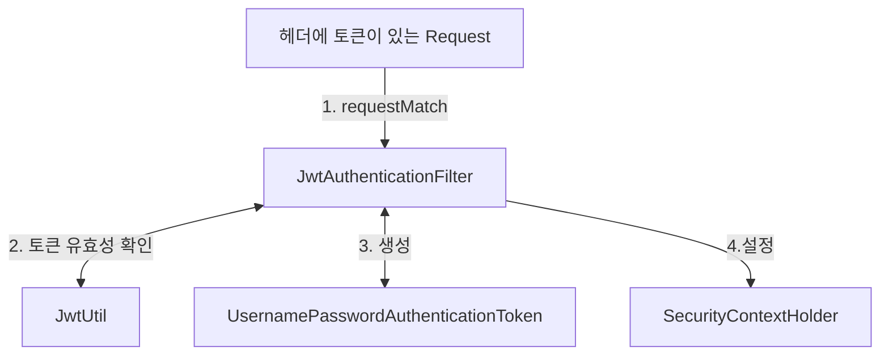

Spring JWT 인증을 구현하는 다양한 방법이 있다.       
물론 엄청 어려운 방법도 있다. (= 오만 가지 클래스, 인터페이스 다 구현하기)

JWT를 Spring으로만 4번..? 3번? 구현하면서
이번에는 제일 간단한 방법으로 가고자 했다.

정석대로 가는 방법도 한번 짜보고, 글도 써볼 예정이다.

# 1. 인증 구조 이해
간단하게 구현하더라도 본질을 이해가는 것이 중요하다고 생각한다.     
(그래야 버그도 해결하고, 학습도 할 수 있다!)    

그래서 JWT 인증 구조와 스프링 인증 구조를 **무조건** 이해해야 한다.    

링크 : [Servlet Authentication Architecture](https://docs.spring.io/spring-security/reference/servlet/authentication/architecture.html)

*하지만 당장 구현이 급하다면... 어쩔 수 없다 😅*

# 2. 인증 구조 살펴보기
![[Pasted image 20240613173836.png|{width=50%}]]
1. AbstractAuthenticationProcessingFilter
	- Request 중 원하는 request를 선택하여 인증 과정을 시작한다.
	- 없으면 인증 과정을 시작 할 수 없다.
2. Authentication
	- 인증 정보를 담는 객체를 정의한 인터페이스
3. AuthenticationManager
	- AuthenticationManager의 구현체는  ProviderManager이고
	   ProviderManager는 여러 개의 AuthenticationProvider을 통해 인증한다.
	- 즉,  AuthenticationProvider 를 구현해서 등록하는 것이 맞는 방법이다.
4. SecurityContextHolder
	- 인증 정보를 가지고 있다.
	- 인증 실패시, SecurityContext 를 clear 한다.
	- 인증 성공시, SecurityContext 를 설정(setAuthentication) 한다.

> [!info] 요약
> 필터에서  인증이 필요한 Request를 잡아서,     
> Authentication을 생성하고,      
> AuthenticationManager 에게 넘겨서 이걸 인증시킨다.        
> AuthenticationManager 는 ProviderManager로 구현되어 있고,         
> ProviderManager는 여러 개의 AuthenticationProvider를 가지고 있다.        

# 3. 우리의 구현 방식 (ver. Simple)
### 로그인
1. /login 에서 사용자 인증 정보를 받고 맞다면, JWT 토큰을 생성하고 Response에 담아 보낸다.
2. 사용자는 Response에 있는 토큰을 이용하여 인증을 진행한다.
### 인증
1. (프론트) /login에서 발행한 토큰을 `Authorization : Bearer <token>`에 담아 보낸다.
2. JwtAuthenticationFilter에서 `Authorization` 헤더에 토큰이 있는지 확인한다.
3. 있다면, 토큰 유효성을 확인하고, 토큰 정보를 활용해 직접 인증 완료된Authentication(UsernamePasswordAuthenticationToken)을 생성한다.
4. 생성한 Authentication 을 SecurityContextHolder를 이용해 SecurityContext에 설정한다.
5. 인증 완료



# 3. 구현 상세
구현할 부분은 크게 4가지이다.
1. `WebSecurityConfig`
2. `JwtAuthenticationFilter extends OncePerRequestFilter`
3. `AuthController.login`

> [!caution] 주의사항
> 1. 올바른 길은 아니라고 생각한다. 올바른 길은 작성 예정
> 2. /refresh-token 이 구현되어있지 않다. (= 올바른 JWT 인증이라고 볼 수 없다.)

## WebSecurityConfig
> [!question] 다른 코드들이랑 다른데?
> 과거 버전에서는 WebSecurityConfigurerAdapter 를 이용해서 설정했으나,
> Spring 버전이 올라가면서 deprecated 되고, 삭제되었다.
> 

```java
@Configuration  
@RequiredArgsConstructor  
@EnableWebSecurity  
public class WebSecurityConfig {  
    private final JwtAuthenticationFilter jwtAuthenticationFilter;  
  
    @Bean  
    public SecurityFilterChain securityFilterChain(HttpSecurity http) throws Exception {  
        http  
                .csrf(csrf -> csrf.disable())  // csrf 설정
	            // 인증이 필요한 부분 설정 (모두 허용 for test)
                .authorizeHttpRequests(request -> request.anyRequest().permitAll())  
                // 세션 인증 방식 설정 (JWT 이므로 Stateless)
                .sessionManagement(sessionManagement ->  
        sessionManagement.sessionCreationPolicy(SessionCreationPolicy.STATELESS))  
			    // 로그아웃 URL 설정
                .logout(logout -> logout  
                        .logoutUrl("/logout")  
                )  
                // 인증 필터 설정
                .addFilterBefore(jwtAuthenticationFilter, UsernamePasswordAuthenticationFilter.class)  
        ;  
  
        return http.build();  
    }
}
```
Spring Http Security 전반을 설정한다.
- `.csrf` 에서 CSRF 관련 설정을 끈다.
	- CSRF 는 인증 정보가 자동으로 설정되어 요청이 실행될 때 위험하다.
	- 하지만 JWT를 헤더에 설정해줘야 하는 JWT 특성상 CSRF 공격에 비교적 안전하다
- `.authorizeHttpRequests` 인증이 필요한 부분을 모두 허용한다.
	- 어플리케이션 개발 중에 해봐야 할 것이 많다. (디버깅, 테스트 등등)
	- 추후 개발이 어느정도 되었을 때, 인증 필요한 부분만 막는 것을 추천한다.
- `.sessionManagement` 쿠키-세션 기반이 아닌 JWT(Stateless)이므로 Stateless로 설정한다.
- `.addFilterBefore` JWT 인증을 맡고 있는 JwtAuthenticationFilter를 UsernamePasswordAuthenticationFilter 앞에 배치한다
	- Authentication 구현체로 UsernamePasswordToken을 사용할 것이기 때문이다.
## JwtAuthenticationFilter
```java
@Override  
protected void doFilterInternal(HttpServletRequest request, @NonNull HttpServletResponse response, @NonNull FilterChain filterChain) throws ServletException, IOException {  
	// 헤더 확인
    String authorizationHeader = request.getHeader(JwtConstants.AUTHORIZATION_HEADER);  
    if (authorizationHeader == null) {  
		// Authorization 헤더가 없는 경우 (= 클라이언트의 인증 의도가 없다.)
        logger.debug("Authorization header is empty");  
        filterChain.doFilter(request, response);  
        return;  
    }  
    if (!authorizationHeader.startsWith(JwtConstants.BEARER_PREFIX)) {  
		// 헤더에 값이 있는데, JWT인증이 아닐 경우
        throw new BadCredentialsException("Error authentication token");  
    }  
    try {  
	    // 토큰 추출
        String token = authorizationHeader.substring(7);
        // 토큰 유효성 확인 & 변환 (아래에 convert 코드 있음)
        Authentication authentication = convert(token);  
        // 인증 정보 설정
        SecurityContextHolder.getContext().setAuthentication(authentication);  

		// 다음 필터로...
        filterChain.doFilter(request, response);  
    } catch (AuthenticationException exception) {
	    // 에러 처리
        logger.debug("AUTHENTICATION FAILED", exception);  
        failureHandler.onAuthenticationFailure(request, response, exception);  
    }  
}
```

`OncePerRequestFilter`를 에서 구현해야 하는 메서드는 `doFilterInternal`밖에 없다.

**JwtAuthenticationFilter의 역할은 아래와 같다.**
1. 헤더에서 token 확인하기
2. 토큰 유효성 확인하기
3. SecurityContextHolder에 인증 정보 설정하기

아래는 token 유효성을 확인하는 `convert` 코드이다.
`org.springframework.security.web.authentication.AuthenticationConverter`를 참조했다.

```java
private Authentication convert(String token) {  
    DecodedJWT decodedJWT;  
    try {  
        decodedJWT = JwtUtil.verify(token);  
    } catch (JWTVerificationException exception) {  
        throw new BadCredentialsException(exception.getMessage());  
    }  
  
    String username = JwtUtil.getUsername(decodedJWT);  
    CustomUserDetails customUserDetails = new CustomUserDetails(username, null);  
    return new UsernamePasswordAuthenticationToken(customUserDetails, null, customUserDetails.getAuthorities());  
}
```

token verification 만 하고, 인증 처리를 한다.


## AuthController.login
```java
@Slf4j  
@RequiredArgsConstructor  
@RestController  
public class AuthController {  
    private final AuthService authService;  
  
    @PostMapping("/login")  
    public UserLoginResponse login(@RequestBody UserLoginRequest loginRequest, HttpServletResponse response) {  
        log.debug("Login request: {}", loginRequest);  
        return authService.login(loginRequest.email(), loginRequest.password(), response);  
    }  
}
```

요청속 로그인 요청을 처리하고, 사용자 정보가 맞다면 토큰을 생성해서 응답한다.
AuthService 의 login 코드는 다음과 같다.

```java
public UserLoginResponse login(String email, String password, HttpServletResponse response) {  
	// 유저 찾기
    Optional<User> optionalUser = userRepository.findByEmail(email);  
    if (optionalUser.isEmpty()) {  
        log.debug("Incorrect Email");  
        throw new UsernameNotFoundException("Incorrect Email or Password");  
    }  
    User user = optionalUser.get();  
    // 패스워드 확인
    if (!user.checkPassword(password)) {  
        log.debug("Incorrect password");  
        throw new UsernameNotFoundException("Incorrect Email or Password");  
    } 
     
	// 토큰 발행
    String token = JwtUtil.issue(user);  
    JwtUtil.setHeader(response, token);  
  
    return new UserLoginResponse(token, new UserResponse(user));  
}
```

# 4. 결론
## 장점
**간단하게 개발할 수 있다.**
- 클래스 몇 개만 집어넣으면 된다.

## 단점
**refresh token 이 없다**
- 사실 여기에 붙이면 되긴 한다.   

**단일 책임 위반이다.**
- `JwtAuthenticationFilter`가 너무 많은 일을 하고있다.

## 더 개선할 수 있는 점
**refresh token을 만든다.**
- login 만든 것 처럼, refresh 토큰을 하나 더 발급하고,
- 관련 로직을 추가하면 된다.

**`JwtAuthenticationFilter` 의 책임을 분리한다.**   
사실 이게 복잡한 버전이다.
1. JWT토큰을 필터링해서 Authentication 구현체만 생성한다.
2. AuthenticationManager에게 Authentication을 넘긴다.
3. AuthenticationManager는 토큰 확인을 AuthenticationProvider에게 넘긴다.    
	(! AbstractUserDetailsAuthenticationProvider 참고) 
4.  AuthenticationProvider 에서 인증을 진행한다.
5. 인증이 완료된 Authentication을 Filter에서 SecurityContext에 설정한다.

아래 클래스들을 많이 참고했다. 역시 구현체 흐름 따라서 쓰는게 내 스타일인 것 같다.

> [!tip] 참고 클래스들
> AuthenticationProvder : DaoAuthenticationProvider, AbstractUserDetailsAuthenticationProvider    
> AuthenticationManager : ProviderManger    
> AuthenticaitonFilter : UsernamePasswordAuthenticationFilter, AbstractAuthenticationProcessingFilter    

