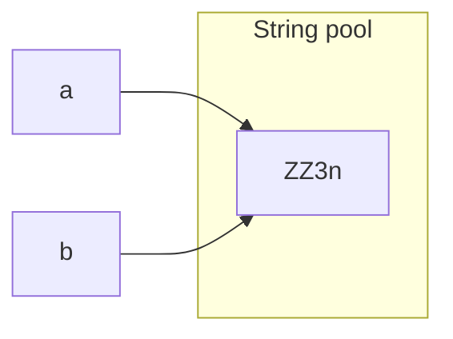

# 문제상황

``` Java
// User class
public boolean checkPassword(String password) {  
    return password == this.password;  
}
```
로그인 처리가 전혀 되지 않아 살펴보니

로그인 시 패스워드를 확인 할 때, 위 부분 항상 false를 반환하고 있었다.

코딩 테스트나, 기타 로직에서는 == 를 잘 썼던 것만 같은데? 오랜만이라 그런 걸까 해서 찾아보았다.

# 원인
우선 ChatGPT 에게 물어보았다.

> [!tip] ChatGPT
> ### `==` 연산자
>
 `==` 연산자는 두 객체의 참조(reference)가 동일한지를 비교합니다. 즉, 두 객체가 같은 메모리 주소를 가리키고 있는지를 확인합니다.
> 
> - `this.password == password`는 `this.password`와 `password`가 동일한 객체인지를 확인합니다.
> - 문자열 리터럴이 아닌 경우나, 두 문자열이 서로 다른 메모리 위치에 있다면, 같은 문자열을 갖고 있더라도 `==` 연산자는 `false`를 반환합니다.
> 
> ### `equals` 메서드
> 
> `equals` 메서드는 객체가 갖고 있는 값을 비교합니다. `String` 클래스의 `equals` 메서드는 두 문자열이 동일한지를 비교합니다.
>
> - `this.password.equals(password)`는 두 문자열의 실제 내용이 동일한지를 확인합니다.
> - 문자열의 값이 같다면, `equals` 메서드는 `true`를 반환합니다.

* == 연산자는 참조를 비교한다.
	* 다른 메모리 위치에 있다면, 같은 문자열을 갖고 있더라도, false를 반환한다.
	* String은 primitive가 아니므로 어쩌면 당연하다.
* equals 메서드는 객체마다 구현이 다를 수 있지만, 객체가 갖고 있는 값을 비교한다.
	* String 클래스의 equals는 두 문자열이 동일한지를 비교한다.


**그렇다면 == 연산자에서 true인 경우는 무엇일까?**

String 의 == 비교에서 true 가 반환되는 경우에는 크게 두 가지가 있다.
1. 리터럴 문자열인 경우
2. 실제로 같은 메모리 주소인 경우

### 1. 리터럴 문자열인 경우
리터럴 문자열이 같은 경우에 true가 반환된다.
``` Java
String a = "ZZ3n";
String b = "ZZ3n";
System.out.println(a == b) // true
```

String 리터럴을 선언하는 경우 Java API 상 String 클래스의 `intern()` 을 사용한다고 한다.

`intern()`은 Heap 영역의 Constant pool에서 같은 문자열을 찾고, 같은 문자열이 있다면 반환한다.
즉, a 와 b는 같은 메모리 주소를 참조하기 때문에 `==`로 비교해도 같은 문자열이 맞다.

## 2. 실제로 같은 메모리 주소인 경우
메모리 위치가 암묵적이지 않고 애초에 같다면 당연히 같은 문자열이다.
```Java 
String secret = new String("password");
User a = User.create("profile1", "email1", secret, "nickname1");  
User b = User.create("profile2", "email2", secret, "nickname2");  
return a.getPassword() == b.getPassword(); // true
```

## 결론
자바에서 == 는 참조 위치가 같은지 비교한다.
Non-primitive 에서는 왠만하면 안 쓰는 것이 낫겠다.